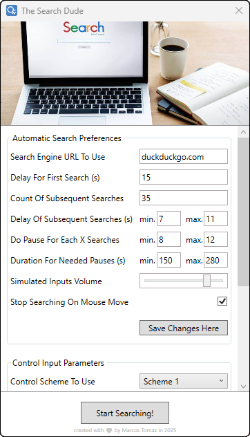

    
     
    Clone this repository and then copy the "Resources-Metter-Compiled" folder to your computer. Extract the content of the file "The-Search-Dude.zip". Read all the instructions below and then just enjoy!

# To use this Software

First, download this repository by cloning the "The-Search-Dude-Compiled" folder to your computer. After that, extract the file "The-Search-Dude.zip" and run the "The Search Dude.exe" file. So just enjoy!

# About this Software

This is simply software designed to automate your searches that need to be done on a Search Engine of your choice, on a PC. This program automates searches, simulating clicks and keystrokes, as if you were using your PC. While you cannot interact with your computer, you are strongly encouraged to monitor it, at least regularly, to ensure everything is working as expected. Further usage instructions are embedded within the program's UI.

# Prerequisites to use this Software

You need to fulfill some requirements to be able to use this Software...

- The computer may need to have <a href="https://download.visualstudio.microsoft.com/download/pr/81531ad6-afa9-4b61-9d05-6a76dce81123/2885d26c1a58f37176fd7859f8cc80f1/dotnet-sdk-6.0.417-win-x64.exe" target="_blank">.Net 6.0</a> installed in order to run the Software.
- The computer must be 64-bit.

# How to edit this Software

The source project of this Software is here in this repository as well. You can simply open the "The-Search-Dude-Source" folder with your Visual Studio IDE and edit the Software.

# Support projects like this

If you liked The Search Dude and found it useful for your, please consider making a donation (if possible). This would make it even more possible for me to create and continue to maintain projects like this, but if you cannot make a donation, it is still a pleasure for you to use it! Thanks! 😀

 

    

 

Created with ❤ by Marcos Tomaz

